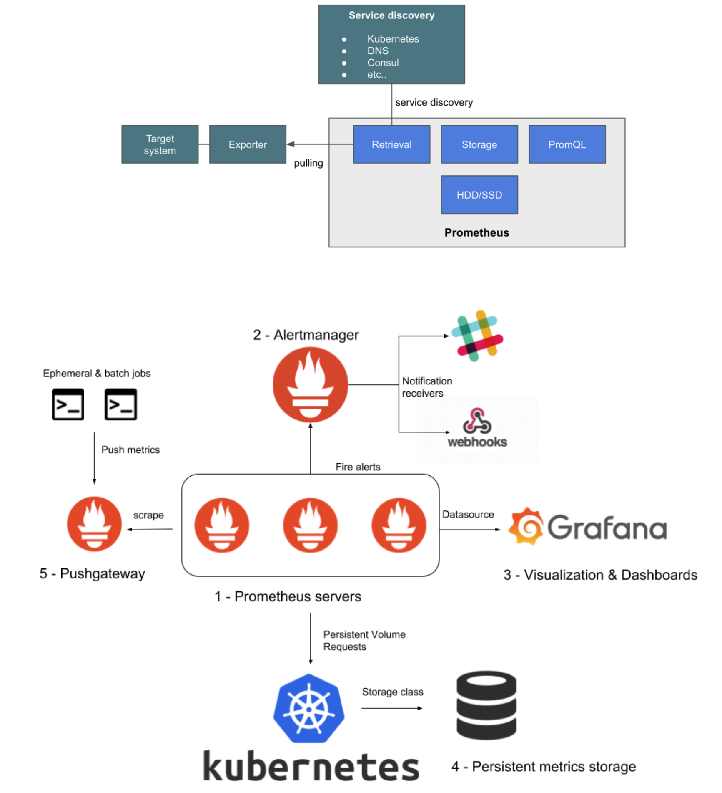

# Prometheus

- 이번에 프로메테우스를 다루면서 알게된 점 정리

- 모니터링 툴의 단순 설치와 어떤 기본으로 제공되는 standard 지표 외에 다른 활용 경험이 없었는데 이번에 새로 알게 된 점은 무엇을 모니터링할 것인지 결정하고 그 지표를 모니터링하기 위해 사용하는 모니터링 툴에서 메트릭을 필터링하는 일은 모니터링을 하는 팀에서 항상 있는 일이고 그 지표를 통해 추가적인 작업을 한다는 것이다.

- 프로메테우스를 Helm으로 설치할 때 kube-prometheus-stack으로 프로메테우스 서버 뿐만 아니라 다른 리소스를 포함해서 설치할 수 있는데 values.yaml을 통해 추가적으로 설치할 리소스(alertmanager 등), 스펙 그리고 수집할 메트릭의 리레이블링, 필터링을 할 수 있다.

- 프로메테우스는 메트릭을 파일 시스템에 블록 파일로 저장한다. 프로메테우스 서버 파드에 접속해 확인할 수 있지만 데이터를 DB의 테이블 조회처럼 확인할 수는 없고 사람이 읽기 어려운 형태로 저장되어 있다.

- 메트릭에는 프로메테우스 자체에 대한 시스템 메트릭, 쿠버네티스 클러스터 내 기본 리소스에 대한 메트릭(kubelet, kube-state-metric등이 수집하는 내용)이 기본적으로 수집되는 내용이고 추가로 리레이블링한 메트릭이 있다.

- 위에서 언급한 기본적으로 수집하는 메트릭들을 drop이 가능한지는 아직 모르겠다.

- 추가로 리레이블링하는 메트릭은 기존 메트릭의 재가공일 수도 있고 엔드포인트를 추가하여 Istio처럼 기본 리소스가 아닌 리소스의 지표를 추출할 수도 있다.

- /status에서는 프로메테우스의 상태, /metrics에서는 시스템 메트릭의 값, /graph에서는 수집한 메트릭을 PromQL로 조회하거나 그래프를 볼 수 있다.

- PromQL은 프로메테우스가 저장한 메트릭을 조회하는 쿼리문이다. `count(count by(__name__)({__name__!~"prometheus_.*|go_.*|net_conntrack.*", job!=""}))` 시스템 메트릭 몇가지를 제외한 나머지 메트릭 종류의 수를 구하는 쿼리문이다.

```yaml
alertmanager:
  enabled: false
prometheus:
  enabled: true
  nodeSelector:
    nodetype: prometheus
  service:
    type: NodePort
    # nodePort: 30008
    annotations:
      prometheus.io/scrape: "true"
  prometheusSpec:
    scrapeInterval: 10s
    evaluationInterval: 10s
    storageSpec:
      volumeClaimTemplate:
        spec:
          storageClassName: gp2
          accessModes: ["ReadWriteOnce"]
          resources:
            requests:
              storage: 100Gi
    resources:
      requests:
        memory: "20Gi"
        cpu: "3"
    additionalScrapeConfigs:
            - job_name: "istiod"
        kubernetes_sd_configs:
          - role: endpoints
            namespaces:
              names:
                - istio-system
        relabel_configs:
          - source_labels:
              [
                __meta_kubernetes_service_name,
                __meta_kubernetes_endpoint_port_name,
              ]
            action: keep
            regex: istiod;http-monitoring
        metric_relabel_configs:
          - source_labels: [__name__]
            action: keep
            regex: (istio_request_duration_milliseconds_bucket|istio_requests_total)
```

## 모니터링 툴이 수집하는 데이터의 유형

- 우선 로그와 메트릭으로 이분할 수 있는데 두 데이터의 차이는 컨텍스트가 있는가 없는가이다.

- 로그는 이벤트 기반 데이터인데 이벤트에 대한 컨텍스트를 일부 기록하는 것이다.

### 로그의 종류

- `데이터베이스 로그(트랜잭션 로그)`는 주요 비즈니스 로직의 수행 결과라고 볼 수 있으므로 가장 중요한 로그이다.

- `시스템 로그`는 운영체제에서 발생하는 로그로 시스템의 상태, 서비스의 상태, 하드웨어 상태 등을 의미한다.

- `어플리케이션 로그`는 실행중인 어플리케이션의 로그로 어플리케이션을 개발하는 데에 사용하는 프레임워크가 대부분 이 로그를 남기는 기능을 포함하고 있다.

- `네트워크 로그`는 HTTP 요청 등의 네트워크 트래픽과 이벤트를 기록하는 로그로 트래픽 분석과 문제 해결에 필요하다.

## 동작 방식과 장단점

- 

- https://owin2828.github.io/devlog/2020/03/13/etc-5.html

- 단점은 확실히 풀링 주기가 있고 풀링되는 순간의 정보로 유추하기 때문에 완전히 실시간은 아니라는 점인 것 같다.

- 그런데 찾아보니 AWS CloudWatch는 1초 단위 수집도 가능하지만 기본이 1분 단위여서 이거랑 비교하면 10초 단위면 훨씬 자주하는 것 같다.

- 프로메테우스는 기본이 15초 단위로 수집이다.
